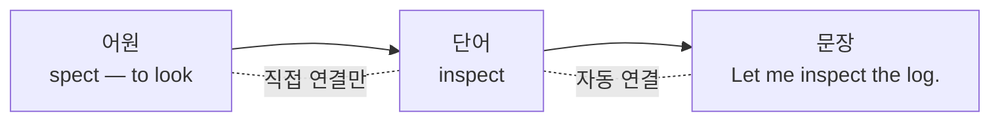

# dev-eng

영어 문서를 읽다가 막힌 단어를 그 자리에서 잡아두고, 나중에 다시 찾아보기 위한 데스크탑 앱입니다.

단어만 모아두면 맥락이 남지 않습니다. 이 앱은 **어원 → 단어 → 문장** 세 층으로 나눠 저장하고,
그 사이의 관계를 가능한 만큼 자동으로, 나머지는 손으로 잇습니다.



---

## 무엇을 할 수 있나

- **세 레이어 목록** — 어원 / 단어 / 문장 탭. 표기·등록일·방문 수로 정렬, 태그로 필터
- **자동 연결** — 단어를 등록하면 그 단어가 든 문장이, 문장을 등록하면 그 안의 단어가 자동으로 이어집니다
- **디테일 뷰** — 이웃 레이어를 파티션으로 펼치고, 클릭하면 그 항목으로 이동합니다
- **연결 관리** — 자동/직접 연결을 구분해 보여주고, 손으로 잇거나 끊을 수 있습니다
- **복습 우선순위** — 디테일 뷰를 연 횟수를 세어 자주 찾아본 항목을 막대로 보여줍니다

---

## 자동 연결이 하는 일과 못 하는 일

문장을 저장할 때 낱말로 쪼개 색인해두고, 단어를 찾을 때 같은 방식으로 펼쳐서 맞춥니다.
양쪽을 같은 규칙으로 펼치기 때문에 **어느 쪽을 먼저 등록하든 결과가 같습니다.**

|              |                                                                                         |
| ------------ | --------------------------------------------------------------------------------------- |
| 잡는 것      | 복수형·과거형·진행형 (`runs`, `walked`, `running`, `studies`), 소유격, 하이픈 복합어    |
| 못 잡는 것   | **불규칙 변화** (`go`/`went`, `be`/`was`) — 이건 디테일 뷰에서 직접 연결합니다          |
| 하지 않는 것 | **어원 추정** — 접사만 보고 판정하면 오탐이 너무 많아, 어원-단어는 직접 연결만 받습니다 |

자동 연결이 틀렸을 때 `×`로 끊으면 **끊었다는 사실이 기록되어**, 이후 문장이나 단어를 수정해
자동 연결이 다시 계산돼도 되살아나지 않습니다.

---

## 실행

```bash
npm install
```

```bash
npm run dev
```

`better-sqlite3` 는 네이티브 모듈이라 Electron ABI 에 맞춰 다시 빌드해야 합니다.
`postinstall` 이 알아서 처리하지만, 그만큼 설치가 느립니다.

### 그 밖의 명령

| 명령                | 하는 일                                        |
| ------------------- | ---------------------------------------------- |
| `npm test`          | 토큰화·어형 변형 규칙 단위 테스트              |
| `npm run typecheck` | 메인/렌더러 타입 검사                          |
| `npm run lint`      | ESLint                                         |
| `npm run db:seed`   | 개발용 예시 데이터 넣기 (앱을 한 번 실행한 뒤) |
| `npm run build:mac` | `.dmg` 만들기 → `release/`                     |

Apple Silicon 용으로 만들려면 `npx electron-builder --mac --arm64` 를 씁니다.
서명은 꺼져 있어서(`identity: null`) 배포하려면 Developer ID 인증서가 필요합니다.

---

## 데이터

SQLite 파일 하나에 전부 들어갑니다.

```
~/Library/Application Support/dev-eng/dev-eng.db
```

지우고 앱을 다시 켜면 빈 상태로 시작합니다. 스키마 변경은 마이그레이션으로만 하며,
적용된 버전은 `PRAGMA user_version` 에 남습니다.

---

## 구조

```
src/
├── main/          Electron 메인 — DB를 소유하는 유일한 곳
│   ├── db/        연결, 마이그레이션
│   ├── repositories/
│   ├── services/  자동 연결 (토큰화·어형 변형)
│   └── ipc/       zod 로 입력을 검증하는 채널 핸들러
├── preload/       contextBridge 로 노출하는 API
├── renderer/      React 화면
└── shared/        양쪽이 함께 쓰는 타입과 스키마
```

렌더러는 `contextIsolation: true`, `nodeIntegration: false` 로 돌아갑니다.
DB 에 닿으려면 반드시 preload 통로를 지나야 하고, 그 경계에서 모든 입력이 검증됩니다.

세 레이어는 테이블을 나누지 않고 `entries` 한 테이블에 `layer` 구분자로 담습니다.
주제·메모·태그·연결·방문 수라는 형태가 셋 다 같아서, 나누면 같은 로직을 세 번 쓰게 됩니다.

연결 규칙은 애플리케이션이 아니라 DB 트리거가 지킵니다. 어원과 문장을 직접 잇거나
레이어를 거슬러 잇는 행은 만들어질 수 없습니다.

---

## 만드는 중 정한 것들

- **TypeScript 5.9 고정** — typescript-eslint 가 아직 7 을 지원하지 않습니다
- **Vite 7 고정** — electron-vite 5 가 지원하는 상한입니다
- **라우터 라이브러리 없음** — 화면이 둘뿐이라 필요한 건 URL 이 아니라 되짚을 수 있는 스택입니다
